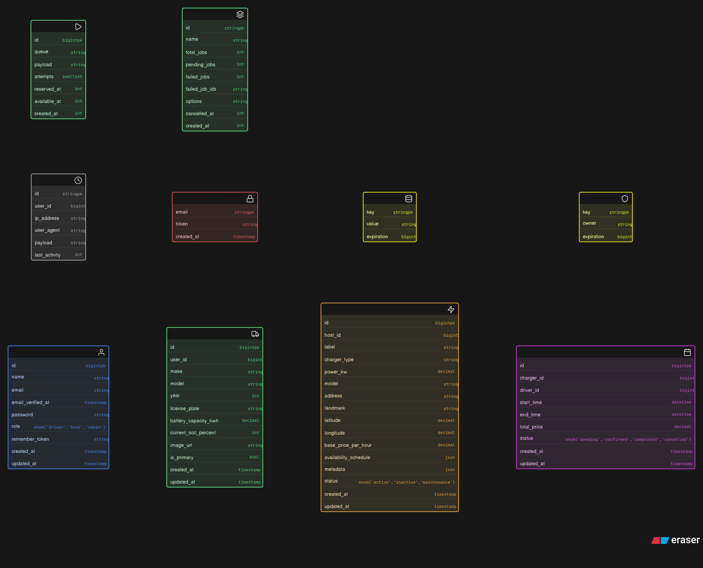

<div align="center">

# ⚡ chrgbnb

### The Decentralized EV Charging Ecosystem

A production-grade, community-driven marketplace connecting **Electric Vehicle Drivers** with **Private Charging Hosts** through a secure, scalable, and intelligent charging platform.

<p align="center">


</p>

---

### 🚗 Empowering Community EV Charging

*"Powering the community, one socket at a time."*

</div>

---

# 📑 Table of Contents

- [Overview](#overview)
- [System Architecture](#system-architecture)
- [Landing Page](#landing-page)
- [Registration](#registration)
- [Driver Dashboard](#driver-dashboard)
- [Host Dashboard](#host-dashboard)
- [Host Charger Network](#host-charger-network)
- [Admin Dashboard](#admin-dashboard)
- [SQL Architecture](#sql-architecture)
- [Authentication & RBAC](#multi-tier-authentication--rbac)
- [Core Engine Features](#core-engine-features)
- [Technology Stack](#technology-stack)
- [Deployment](#deployment--installation)
- [Security](#security--reliability)
- [License](#license)

---

# Overview

**chrgbnb** is a **production-grade, community-driven EV charging marketplace** built using **Laravel 11**.

The platform bridges the gap between **private charging station owners (Hosts)** and **Electric Vehicle Drivers**, creating a decentralized charging ecosystem that is scalable, secure, and easy to use.

Whether you're looking to monetize your home charger or find the nearest charging station, **chrgbnb** provides a seamless experience backed by enterprise-grade architecture.

---

# System Architecture

chrgbnb follows a **Multi-Role SaaS Architecture** with strict separation between different user domains.

- 🔐 Admin
- ⚡ Host
- 🚗 Driver

This provides:

- Tenant Isolation
- Secure Role Permissions
- Independent Dashboards
- Optimized Workflows
- High Scalability

---

# Landing Page

<p align="center">

</p>

<p align="center">
<i>Modern landing page introducing the decentralized EV charging marketplace.</i>
</p>

⬆️ [Back to Top](#-table-of-contents)

---

# Registration

<p align="center">

</p>

<p align="center">
<i>Unified registration experience supporting multiple user roles.</i>
</p>

⬆️ [Back to Top](#-table-of-contents)

---

# Driver Dashboard

The Driver dashboard focuses on charging discovery, bookings, and charging history.

<p align="center">

</p>

<br>

<p align="center">

</p>

<br>

<p align="center">

</p>

<br>

<p align="center">

</p>

### Features

- Real-time charging station search
- Booking management
- Charging history
- Interactive maps
- Nearby charger discovery
- Secure reservations

⬆️ [Back to Top](#-table-of-contents)

---

# Host Dashboard

Already have an account? **Sign In**

<p align="center">

</p>

The Host dashboard enables charger owners to efficiently manage their charging business.

### Capabilities

- Charger Management
- Revenue Monitoring
- Pricing Configuration
- Booking Management
- Availability Scheduling

⬆️ [Back to Top](#-table-of-contents)

---

# Host Charger Network

<p align="center">

</p>

<br>

<p align="center">

</p>

### Features

- Add Chargers
- Edit Chargers
- Live Availability
- Dynamic Pricing
- Usage Statistics

⬆️ [Back to Top](#-table-of-contents)

---

# Admin Dashboard

<p align="center">

</p>

The Admin dashboard acts as the command center for the entire charging ecosystem.

### Responsibilities

- User Verification
- Station Approval
- Financial Auditing
- Platform Analytics
- System Monitoring
- Event Logging

⬆️ [Back to Top](#-table-of-contents)

---

# SQL Architecture

<p align="center">

</p>

The relational database architecture ensures:

- High Performance
- Data Integrity
- Efficient Relationships
- Optimized Query Performance

⬆️ [Back to Top](#-table-of-contents)

---

# Multi-Tier Authentication & RBAC

## 🔐 Admin Domain

Centralized oversight of the charging network including:

- User verification
- Platform administration
- Financial auditing
- Analytics

---

## ⚡ Host Domain

Dedicated management portal featuring:

- Station Management
- Dynamic Pricing
- Revenue Analytics
- Booking Controls

---

## 🚗 Driver Domain

Consumer-focused interface offering:

- Geospatial Search
- Live Availability
- Secure Bookings
- Charging History

⬆️ [Back to Top](#-table-of-contents)

---

# Core Engine Features

## 🌍 High-Precision Search & Discovery

- Leaflet.js + OpenStreetMap Integration
- Live Geospatial Search
- Smart Availability Filtering
- Connector Type Filtering
- Power Output Filtering
- Urban Location Clustering

---

## 💰 Dynamic Pricing Engine

- Minute-Level Billing
- Variable Weight Pricing
- Fast Charger Multipliers
- Escrow Ready Calculations
- Locked Session Pricing

---

## 📊 Real-Time Analytics

- Chart.js Dashboards
- Revenue Visualization
- System Health Monitoring
- API Uptime Tracking
- Database Latency Monitoring
- Detailed Event Logs

⬆️ [Back to Top](#-table-of-contents)

---

# Technology Stack

| Layer | Technology |
|:-------|:-----------|
| **Framework** | Laravel 11 (PHP 8.2+) |
| **Frontend** | Blade, Bootstrap 5, Vanilla JavaScript |
| **Database** | MariaDB / MySQL |
| **Visualization** | Chart.js |
| **Maps** | Leaflet.js + OpenStreetMap |
| **Animations** | AOS |
| **Utilities** | Carbon, FontAwesome 6 |

⬆️ [Back to Top](#-table-of-contents)

---

# Deployment & Installation

## 1️⃣ Install Dependencies

```bash
composer install

npm install

npm run build
```

---

## 2️⃣ Configure Environment

```bash
cp .env.example .env

php artisan key:generate
```

---

## 3️⃣ Database Setup

The project ships with a comprehensive Bangalore-based charging network seeder.

```bash
php artisan migrate:fresh --seed
```

---

## 4️⃣ Launch Application

```bash
php artisan serve
```

Application:

```
http://127.0.0.1:8000
```

⬆️ [Back to Top](#-table-of-contents)

---

# Security & Reliability

✔ Custom CheckRole Middleware

✔ Strict RBAC Enforcement

✔ SQL Injection Protection

✔ XSS Protection

✔ Eloquent ORM Security

✔ Blade Escaping

✔ Diagnostic Logging

✔ Type-Safe Pricing Engine

✔ 500 Error Resistant Architecture

⬆️ [Back to Top](#-table-of-contents)

---

# License

Distributed under the **MIT License**.

See the **LICENSE** file for more information.

---

<div align="center">

# ⚡ chrgbnb

### Powering the community, one socket at a time.

Built with ❤️ using Laravel.

</div>
