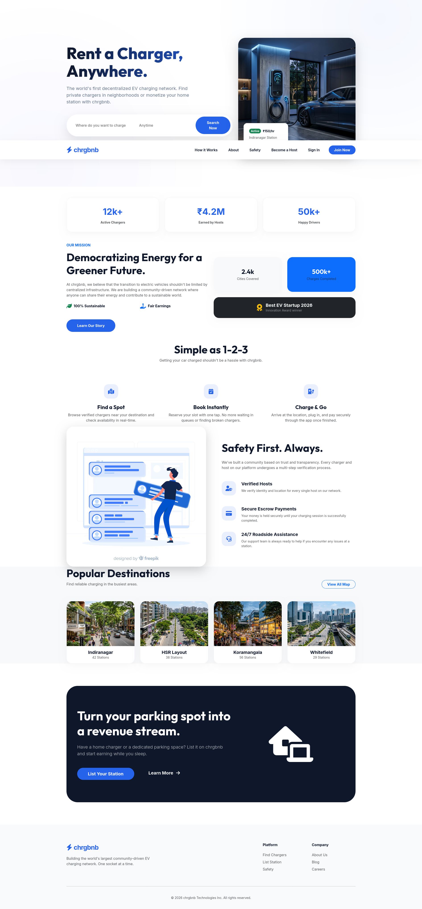
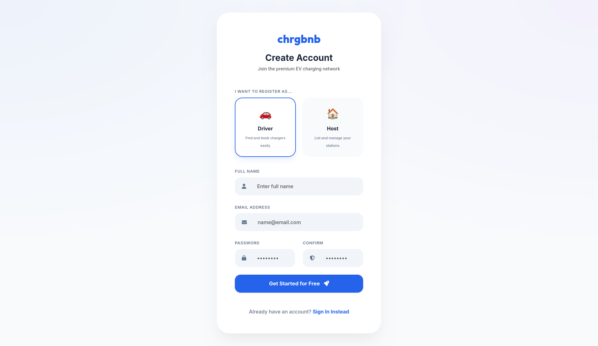
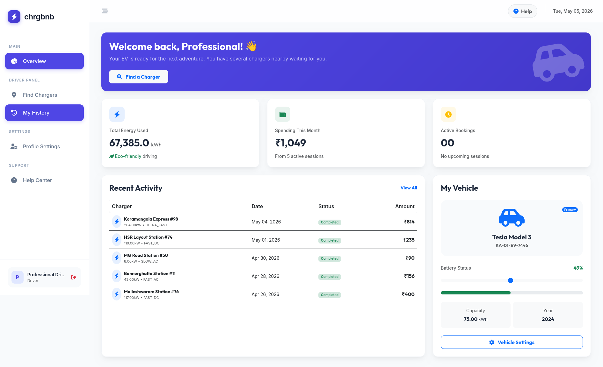
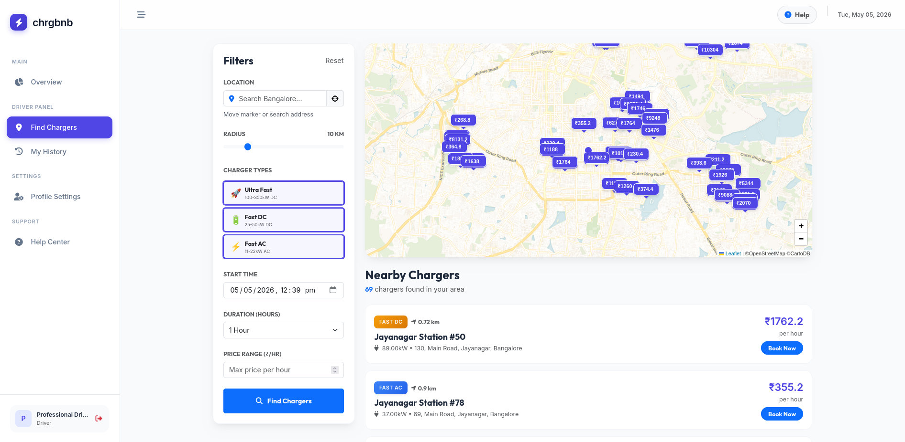
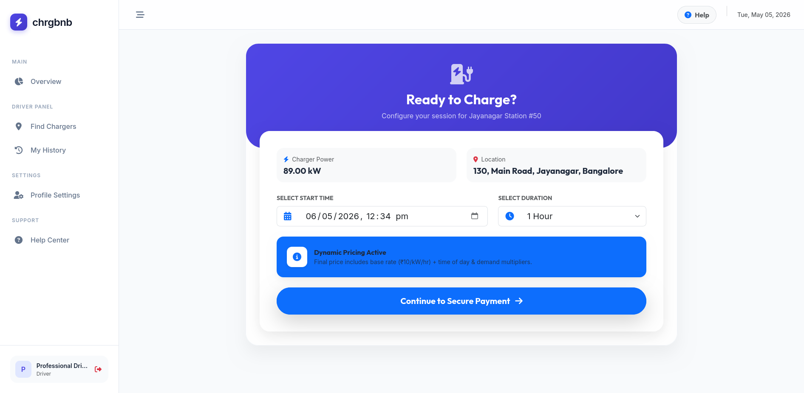
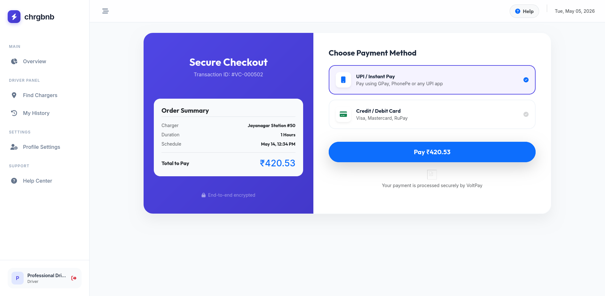
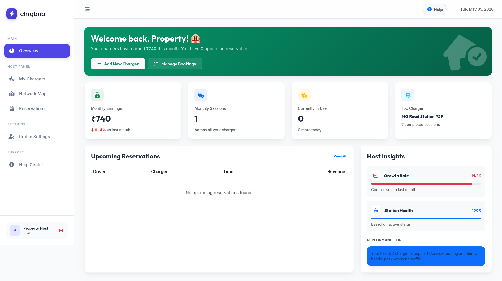
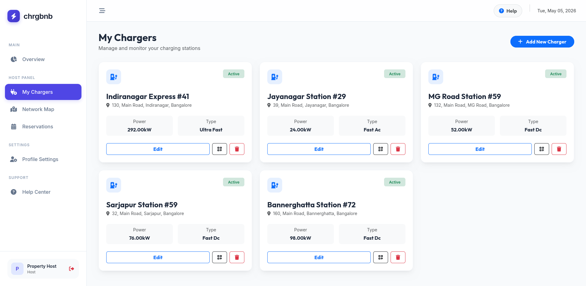
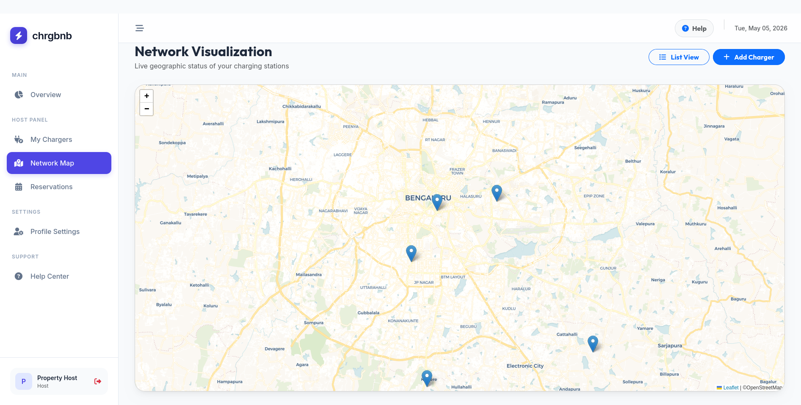
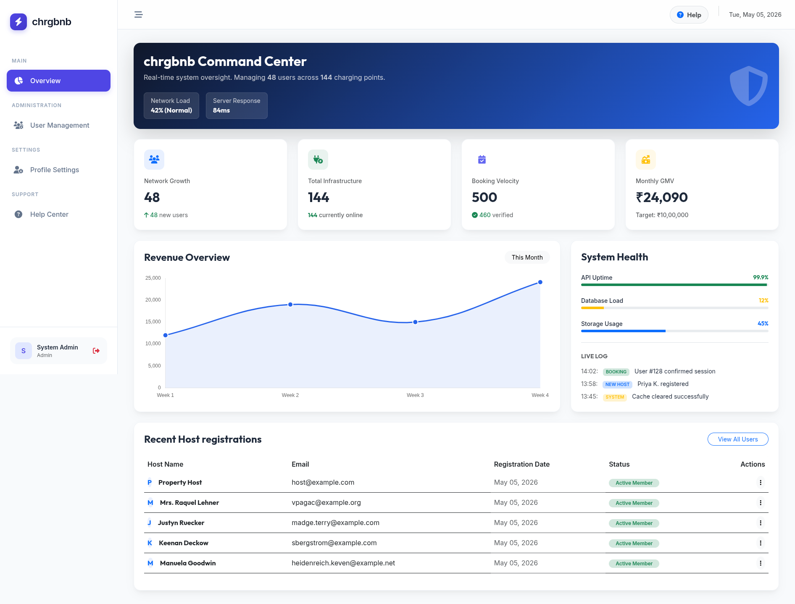

# chrgbnb: The Decentralized EV Charging Ecosystem

**chrgbnb** is a production-grade, community-driven marketplace for Electric Vehicle (EV) charging. Built on a robust Laravel foundation, it bridges the gap between private energy providers (Hosts) and EV owners (Drivers), creating a seamless, scalable, and secure charging infrastructure.

---

## 🏛️ System Architecture

chrgbnb is architected as a **Multi-Role SaaS Platform** with distinct operational silos for different user personas, ensuring high data isolation and security.

### Landing page



### Register page



### Car (Driver) Dashboard






### Host Dashboard

Already have an account? Sign In


### Host Charger Network




## Admin Dashboard



## SQL Architecture

.png>)

### Multi-Tier Authentication & RBAC

- **Admin Domain**: Centralized oversight of the entire charging network, user verification, and financial auditing.
- **Host Domain**: Specialized interface for station management, dynamic pricing control, and revenue analytics.
- **Driver Domain**: Consumer-facing experience focused on geospatial discovery, real-time availability, and secure booking.

---

## Core Engine Features

### High-Precision Search & Discovery

- **Geospatial Mapping**: Integrated with Leaflet.js and OpenStreetMap for real-time station discovery.
- **Intelligent Filtering**: Filter by power output (kW), connector type, and immediate availability.
- **Location Clustering**: High-performance clustering algorithms for dense urban environments like Bangalore.

### Dynamic Pricing Engine

- **Minute-Based Precision**: Avoids rounding errors by calculating costs down to the minute.
- **Variable Weighting**: Pricing dynamically scales based on charger speed (Ultra-Fast vs. AC) and duration.
- **Escrow-Ready Logic**: Backend supports pre-calculation and locking of session prices to prevent rate fluctuations during charging.

### Real-Time Analytics (Command Center)

- **Chart.js Integration**: Visual representation of revenue trends and network growth.
- **System Health Monitor**: Live tracking of API uptime, database latency, and network load.
- **Event Logging**: Granular activity logs for all critical system actions (bookings, registrations, status changes).

---

## Technology Stack

| Layer             | Technology                        |
| :---------------- | :-------------------------------- |
| **Framework**     | Laravel 11 (PHP 8.2+)             |
| **Frontend**      | Vanilla JS, Blade, Bootstrap 5    |
| **Visualization** | Chart.js, Leaflet.js              |
| **Animations**    | AOS (Animate On Scroll)           |
| **Utilities**     | Carbon (Date/Time), FontAwesome 6 |
| **Database**      | MariaDB / MySQL                   |

---

## Deployment & Installation

### 1. Environment Preparation

```bash
composer install
npm install && npm run build
cp .env.example .env
php artisan key:generate
```

### 2. Database Synchronization

The project includes a comprehensive seeder that generates a realistic Bangalore-based charging network:

```bash
php artisan migrate:fresh --seed
```

### 3. Application Lifecycle

```bash
php artisan serve
```

---

## Security & Reliability

- **Middleware Guarding**: Custom `CheckRole` middleware ensures strict cross-tenant isolation.
- **Sanitized Inputs**: Full protection against SQL injection and XSS via Eloquent and Blade.
- **Resilient Logic**: 500-error resistant pricing engine with strict type-casting and diagnostic logging.

---

## License

This project is licensed under the MIT License - see the [LICENSE](LICENSE) file for details.

---

**chrgbnb** — _Powering the community, one socket at a time._
